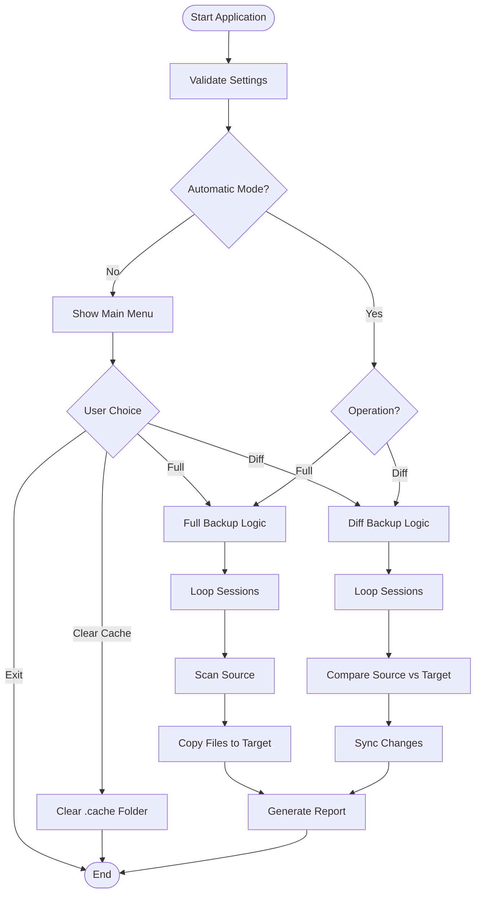

# backups-manager

A cross-platform (Windows / macOS / Ubuntu) TypeScript tool that backs up files via full and differential modes. It ensures your data is synchronized across multiple targets while providing real-time progress tracking and detailed reporting.

## Features

- **Full backup** — copies every file from source to all targets (with exclusions applied).
- **Diff backup** — copies only files that changed since the last run, using size and modification time comparison.
- **Multi-session support** — configure multiple source-to-target backup tasks.
- **Advanced exclusions** — skip specific files, folders, or patterns (e.g., `node_modules`, `*.log`).
- **Live progress** — real-time spinner showing time elapsed, percentage, and current file.
- **Detailed reporting** — generates a comprehensive `BACKUP_REPORT.txt` on the Desktop.
- **Automation ready** — supports automatic mode for Task Scheduler or cron jobs.

## Getting Started

### Prerequisites

- **Node.js**: Version 18 or higher.
- **npm** or **pnpm**: For dependency management.

### Installation

1. Clone the repository:

```bash
git clone https://github.com/orassayag/backups-manager.git
cd backups-manager
```

2. Install dependencies:

```bash
npm install
```

3. Configure your sessions:
   Edit `src/sessions/sessions.json` to define your backup sources and targets.

4. Adjust settings:
   Edit `src/settings/settings.ts` to configure exclusions and automation.

### Quick Start

#### Test Mode (Development)

To run the tool interactively and select your backup mode:

```bash
npm start
```

#### Production Mode

To run the tool automatically (e.g., for scheduled tasks):

```bash
npm run sync
```

Or use CLI arguments for specific operations:

```bash
npm start -- --auto --operation=full
```

## Configuration

### Core Settings

Edit `src/settings/settings.ts` to control the global behavior:

- `excludeNames`: Exact folder/file names to skip.
- `excludePatterns`: Glob patterns for flexible exclusions.
- `automaticMode`: `true` to skip the menu and run immediately.
- `automaticOperation`: Default operation (`'full'` or `'diff'`) for automatic mode.

### Search Configuration

Configure your backup "search" paths in `src/sessions/sessions.json`:

```json
[
  {
    "sourcePath": "C:\\Path\\To\\Source",
    "targetPath": "D:\\Path\\To\\Target"
  }
]
```

### Filtering

Exclusions are handled via `excludeNames` and `excludePatterns` in `settings.ts`. These filters are applied recursively during the directory scan to skip unwanted data like build artifacts or temporary files.

## Available Scripts

### Main Application

```bash
npm start              # Start interactive menu
npm run sync           # Run automatic differential backup
npm run build          # Compile TypeScript to JavaScript
```

### Testing Scripts

```bash
npm test               # Run all tests using Vitest
npm run test:watch     # Run tests in watch mode
npm run test:ui        # Open Vitest UI for visual testing
```

## Project Structure

```
backups-manager/
├── src/
│   ├── index.ts              # Entry point & CLI logic
│   ├── sessions/             # Session configurations (sessions.json)
│   ├── settings/             # Global settings (settings.ts)
│   ├── diff-backup/          # Differential backup implementation
│   ├── full-backup/          # Full backup implementation
│   ├── menu/                 # Inquirer-based interactive menu
│   ├── progress/             # Ora-based progress tracking
│   ├── reporter/             # BACKUP_REPORT.txt generator
│   ├── types/                # Shared TypeScript types
│   ├── utils/                # FS and path utilities
│   └── validators/           # Settings validation
├── automatic-backup.bat      # Windows automation script
└── package.json              # Project dependencies
```

## How It Works



## Architecture Flow

1. **Validation**: Checks `settings.ts` for consistency.
2. **Menu/Mode Selection**: Determines whether to run interactively or automatically.
3. **Session Processing**: Reads `sessions.json` and iterates through each backup task.
4. **Scan/Compare**:
   - **Full**: Scans source recursively with exclusions.
   - **Diff**: Compares source and target using `dir-compare` (size + mtime).
5. **Execution**: Copies files, creates directories, and deletes obsolete files (in diff mode).
6. **Progress Tracking**: Updates the console with real-time stats.
7. **Reporting**: Writes the final outcome to a text file on the Desktop.

## Email Validation Features

_(Repurposed as Smart Comparison Features)_

- **Size Comparison**: Detects changes if file size differs.
- **Modification Time (mtime)**: Detects changes if the file was recently saved.
- **Target Sync**: Identifies files in the target that no longer exist in the source for deletion.
- **Exclusion Mapping**: Efficiently skips paths matching exclusion rules during the scan.

## Console Status Example

```
Time: 00:01:23 | 45.2% | Copying: C:\Source\file.txt to D:\Target\file.txt
```

## Output Files

The tool generates a report on your **Desktop**:

- `BACKUP_REPORT.txt`: Contains session details, status, duration, and a list of failed files. For differential backups, it also includes a table of added, updated, and deleted files.

## Development

### Running Tests

```bash
npm test
```

### Development Mode

Use the following command to watch for changes during development:

```bash
npm run dev
```

## Contributing

Contributions are welcome! Please feel free to submit a Pull Request.

## Built With

- [TypeScript](https://www.typescriptlang.org/) - Programming language
- [Node.js](https://nodejs.org/) - Runtime environment
- [Ora](https://github.com/sindresorhus/ora) - Elegant terminal spinner
- [Inquirer](https://github.com/SBoudrias/Inquirer.js) - Interactive CLI user interface
- [dir-compare](https://github.com/glenn-murray/dir-compare) - Directory comparison utility

## Acknowledgments

- Built for efficient and reliable data synchronization.
- Uses `dir-compare` for high-performance directory diffing.
- Designed with cross-platform compatibility in mind.

## License

This application has an MIT license - see the [LICENSE](LICENSE) file for details.

## Author

- **Or Assayag** - _Initial work_ - [orassayag](https://github.com/orassayag)
- Or Assayag <orassayag@gmail.com>
- GitHub: https://github.com/orassayag
- StackOverflow: https://stackoverflow.com/users/4442606/or-assayag?tab=profile
- LinkedIn: https://linkedin.com/in/orassayag

## Acknowledgments

- Built for educational and research purposes
- Respects robots.txt and implements rate limiting
- Uses user-agent rotation to avoid detection
- Implements polite crawling practices
